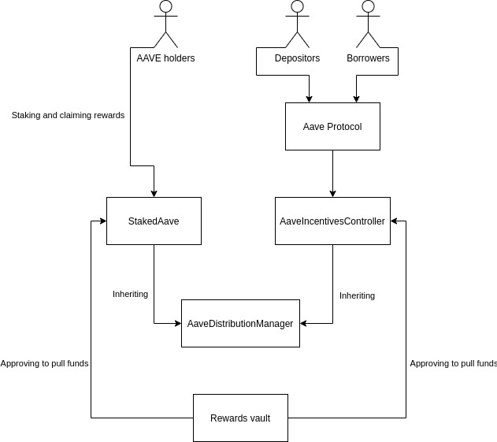

# Aave Incentives contracts

Sets of smart contracts to enable stake of Aave-related assets and rewards distribution based on them.

## Specification

### Architecture

A common parent contract `AaveDistributionManager` is used to keep the "accounting" logic for a set of children front contracts taking care of each type of incentive; being these, initially, a `StakedAave` contract for stake of Aave tokens on the Aave SM (Security Module) which will which be used as security fund in the near future, and a `AaveIncentivesController` contract through which the Aave protocol will interact in order to provider rewards as incentives to users.
The rationale of this inheritance chain in 2 main layers is the clearly conceptual separation between a common part of configurations of the distributions and mathematical calculation, and one specific part for each type of incentive (locking funds in a stake, providing liquidity to a protocol and potentially more in the future).
Additionally, there will be a Rewards vault where the AAVE rewards will be keep, to distribute through the `StakedAave` and the `AaveIncentivesController`. Both will be granted in advance with allowance to pull funds from.
The following sections will go in detail on the specification of both the `AaveDistributionManager` and the different front contracts.

### AaveDistributionManager

Core contract for calculation of multiple distributions with different configurations. All the front contracts which users/aave protocol will interact with inherit from the `AaveDistributionManager`.
It calculates how many rewards belong to a certain user depending on the user's situation defined by the front contract of the distribution. This calculation is done by using a distribution index representing the accumulation of rewards from an emission per second and snapshoting that index on each user to take into account how much of the total belongs to him.

#### Data

- `assets`. Mapping of `AssetData` structs which, for each front contract connected to the `AaveDistributionManager` stores 1 or more of:
  - `emissionPerSecond`: Amount of rewards per second distribution-wide. It's used to calculate the raw amount of rewards to distribute in a time delta since the last update of the following described `index`.
  - `index`: Variable representing the accumulated rewards distributed distribution-wide per unit of token used in the specific child contract of the distribution (per unit of staked Aave in the case of the `StakedAave` child contract). The next index is calculated by the formula on `_getNormalizedDistribution()` **emissionPerSecond _ timeDelta _ 10^PRECISION / balanceOnFrontContract + previousIndex**, scaling it up multiplying by 10^18 in order to not lose precision.
  - `lastUpdateTimestamp`: timestamp when the struct was updated.
  - `userIndexes`: mapping user address => index snapshotted on the user from the one of the distribution.

For the child `StakedAave`, they key of the mapping used is the address of the `StakedAave` itself. In the case of the `AaveIncentivesController`, there is a different key and struct for each aToken and debtToken submitted to incentives.

#### Logic

This contract allows to do the following:

- **Configuration of multiple distributions**: only allowed to a trusted `EMISSION_MANAGER`, allows to list an specific distribution, with some emission per second and front contract.
- **Update of user/distribution state on interaction**: called by the child contract when something happened concerning the situation on the user, for example when he stakes on `StakedAave`, redeems, deposit on the Aave protocol, etc...
- **Get the unclaimed rewards of an user**: self-explanatory, used by the children contracts to check how much rewards were accrued for an user and store the data if needed on their side, by interacting with the `claimRewards()` function.
- **Query information about distributions/users**: by using the different view functions available.

### StakedAave

Contract to stake AAVE token, to be connected with a slashing mechanism in the near future in order to secure the Aave protocol, forming the so called Aave SM (Security Module).
Holders of Aave tokens stae them in this contract, they receive equivalent amount in `stkAAVE` tokens and start accruing rewards in AAVE; rewards previously configured on the father contract `AaveDistributionManager` by the a trusted **EMISSION_MANAGER**. Once they accrued AAVE rewards, they can claim them at any moment but, to withdraw their staked AAVE tokens, they need to activate and wait a cooldown period, and withdraw just after it, during a withdrawal time window.

#### Data

- `stakerRewardsToClaim`: mapping storing the accrued rewards accrued and stored for an user, not taking into account those accrued but not stored yet.
- `stakersCooldowns`: mapping the timestamp of activation of cooldown period for an user, if activated.

#### Logic

This contract allows to do the following:

- **Stake AAVE tokens to start accruing rewards**: through the `stake()` function. The AAVE tokens will be locked in this same contract, and stkAAVE tokens will be minted for the user in the same proportion as AAVE staked, the state in the father `AaveDistributionManager` will be updated and the timestamp of the cooldown will be updated too.
- **Withdraw staked AAVE tokens**: if an user has stkAAVE, he can call the `redeem()` function, burning the stkAAVE and receiving the same proportion of previously staked AAVE. The withdrawal will only suceed if the user in on the withdrawal window after the cooldown period.
- **Activate the cooldown period**: self-explanatory, calling the `cooldown()` function and needed to withdraw the staked AAVE.
- **Claim the accrued rewards**: by calling the `claimRewards()` function, used to update the state and transfer to the user the accrued rewards, consequence of the time he was/is staking.
- **Query information about users**: about their rewards or cooldown period.

#### Cooldown period

The main objective of the cooldown period is to avoid situations on the future Security Module when, if an slashing event happens, people starts withdrawing in mass their staked funds, leaving the protocol uncover and removing the utility on the stake itself.
To achieve this, the most important condition to be fullfilled on any state update/operation involving the `StakedAave` contract is that, if a user staking withdraws, he already respected a cooldown period, which leads that movement of funds should only affect "negatively" the cooldown period.
Depending on the type of operation, the cooldown period is affected in the following way:

- If an user stakes AAVE with/without having any fund staked before, if he didn't have the cooldown activated, it remains the same way.
- If an user stakes AAVE holding already stkAAVE and with cooldown period activated:
  - If the cooldown is expired, remains expired.
  - If the cooldown is still valid, using the amount staked and the current timestamp, it does the weighted average with the current cooldown timestamp of the user.
- If the user redeems AAVE, the cooldown timestamp is set to 0.
- If the user claims rewards, the cooldown timestamp is not affected.
- On transfer of stkAAVE:
- The cooldown timestamp of the sender remains as it is.
- On the recipient:
  - If the recipient is on a valid cooldown period finishing before that the one of the sender, we do the same weighted average as in stake().
  - If the recipient has an expired cooldown timestamp, his cooldown timetamp is set to 0.
  - If both sender and recipient have valid cooldown period activated and the one of the sender ends before than the recipient, the recipient keeps his own.

### AaveIncentivesController

Contract in charge of the incentives for activity on the Aave protocol, inheriting from the `AaveDistributionManager`. Each time an action involving any incentive for an user happens on the Aave protocol, this contract is called to manage the update of the incentives state.

#### Data

- `_usersUnclaimedRewards`: mapping storing the accrued rewards accrued and stored for an user, not taking into account those accrued but not stored yet.

#### Logic

This contract allows to do the following:

- **Communication Aave protocol -> incentives**: through the whitelisted function `handleAction()`, only callable by the Aave lending pool. For every asset and user, one call to this function needs to be done, which will trigger a state update in both the rewards of the user and the distribution data.
- **Claim of user rewards**: by `claimRewards()` function, transferring to the user the AAVE rewards. If the user tries to claim his rewards with the `StakedAave` as target, a bonus will applied on the rewards accumulated from his activity on the protocol, and the `stake()` function on the `StakedAave` will be called.
- **Query information about users**: mainly about the state of their rewards.

## Audits

The Solidity code in this repository has undergone 2 traditional smart contracts' audits by Consensys Diligence and Certik. The reports are:

- Consensys Diligence
- Certik

## Current Mainnet contracts (25/09/2020)

[MAIN]

- **StakedAave proxy** [0x4da27a545c0c5b758a6ba100e3a049001de870f5](https://etherscan.io/address/0x4da27a545c0c5b758a6ba100e3a049001de870f5)
- **StakedAave implementation** [0x74a7a4e7566a2f523986e500ce35b20d343f6741](https://etherscan.io/address/0x74a7a4e7566a2f523986e500ce35b20d343f6741)

## Credits

For the proxy-related contracts, we have used the implementation of our friend from [OpenZeppelin](https://github.com/OpenZeppelin/openzeppelin-sdk/).

## License

The contents of this repository are under the AGPLv3 license.
